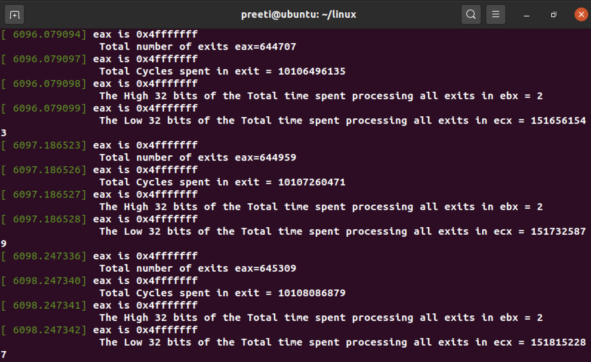
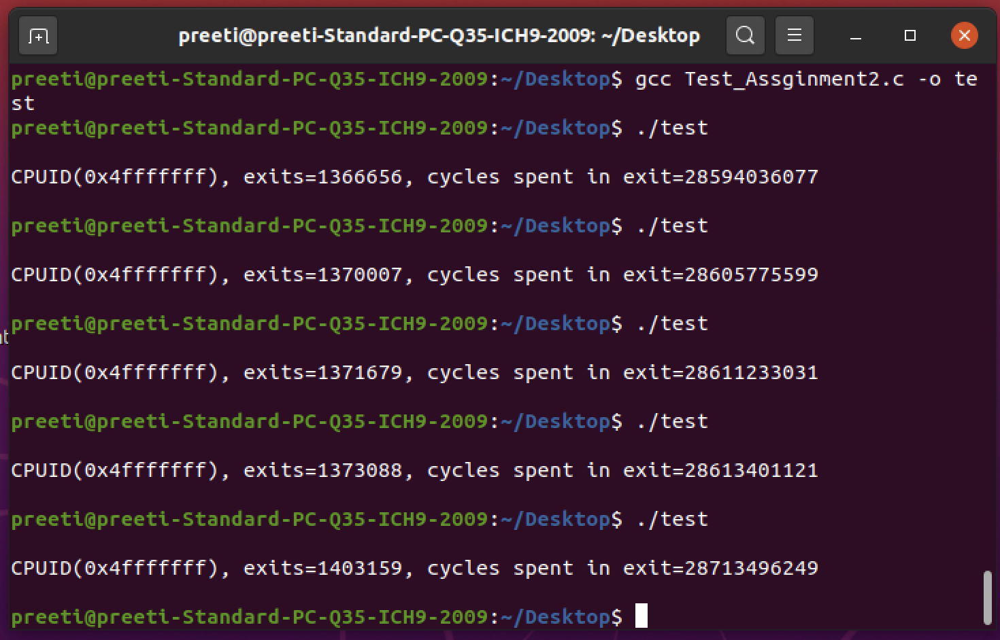

# CMPE_283_Assignment2-modify-cpuid

1. For each member in your team, provide 1 paragraph detailing what parts of the lab that member implemented / researched.

Team Members:

Preeti Parihar- (id:015218073)

*Setup the environment in Mac using VMware Fusion 12.x Pro(Student Licence) and download the ISO disk image file for Ubuntu Desktop(Ubuntu 20.04.1 LTS). Created VM successfully in first attempt by allocating 200GB storage and 6GB RAM and 2 Processors.

*Once successfully reboot I checked version with uname -a and output is 5.10 then using virt manager I setup inner VM using Ubuntu iso file.

*Researched and Discussed about exits and interrupts using SDM as a reference and help each other writing and executing the code.

*Contribution: code for return the total number of exits and the total time spent processing all exits at the path: linux/arch/x86/kvm -> cupid.c and linux/arch/x86/kvm/vmx -> vmx.c

Priyanka Devendran- (id:015231411)

*Setup the environment in Mac using VMware Fusion and installed Ubuntu and then created inner vm.

*Discussed and Researched about about exits and interrupts using SDM as a reference.

*Contribution: code for test program that exercises the functionality in our hypervisor modification.

2.Describe in detail the steps you used to complete the assignment. Consider your reader to be someone skilled in software development but otherwise unfamiliar with the assignment. Good answers to this question will be recipes that someone can follow to reproduce your development steps.

Prerequisites:

You will need a machine capable of running Linux, with VMX or SVM virtualization features exposed. You may be able to do this inside a VM, or maybe not, depending on your hardware and software configuration. You should likely be using the environment you created for assignment 1.

Requirement:

Your assignment is to modify the CPUID emulation code in KVM to report back additional information when a special CPUID “leaf function” is called.
• For CPUID leaf function %eax=0x4FFFFFFF:
◦ Return the total number of exits (all types) in %eax
◦ Return the high 32 bits of the total time spent processing all exits in %ebx
◦ Return the low 32 bits of the total time spent processing all exits in %ecx
▪ %ebx and %ecx return values are measured in processor cycles

# SETUP the Environment:

1.	We installed VMware fusion 12.x Pro in Macbook then Downloaded the ISO disk image for Ubuntu Desktop(Ubuntu 20.04.1 LTS).

2.	Created Virtual Machine by allocating 200GB storage and 4GB RAM.

3.	Clone the Git repository for the latest linux kernel source code :
git clone https://github.com/torvalds/linux.git

4.	Building The Kernel:

To build the kernel (once you have cloned the Linux git repository), the following sequence of commands can be used (eg, for Ubuntu – other distributions have similar steps but may differ in the installation of the build prerequisites):

1.  sudo bash

2.	apt-get install build-essential kernel-package fakeroot libncurses5-dev libssl-dev ccache bison flex libelf-dev

3.	uname -a (and note down your kernel version, for example “5.4.0-52-generic”)

4.	cp /boot/config-4.15.0-112-generic ./.config (substitute your version obtained from the previous step here though)

5.	make oldconfig (and then just use the default for everything, don’t change anything – you can do this by holding down enter)

6.	make && make modules && make install && make modules-install (will take a long time the first time)

7.	reboot

Note: When I reboot I got following error: Gave up waiting for root device. ALERT: UUID=******* does not exits. Dropping to a shell, BusyBox.

Steps I use to solve above error:

1.	reboot -f (one window will open in front of you with 3 options choose advance option and now you have 5 to 6 ubuntu versionselect the ubuntu version same was before the reboot in my case it was 5.4.0-52-genericpress enteropen the terminalgo to linux source folder and execute below mentioned command in sequence and then reboot again )

2.	sudo bash

3.	nproc(To know the number of processing units, in my case it was 2 core, specify the number of cores in -j option in the below command)

4.	sudo make -j 2 && sudo make modules_install -j 2 && sudo make install -j 2

5.	update-grub(no space between update and grub)

6.	make

7.	reboot

8.	Verify that you are using the newer kernel (5.8, etc) after reboot:

    uname -a (In my case version after reboot is 5.10.0-rc1)

# Implement Assignment Functionalities:

1.	I edited cpuid.c and vmx.c for implementing code for calculating total number of  exits and the total time spent processing all exits see cpuid.c and vmx.c

I modify function kvm_emulate_cpuid in the following file:
linux/arch/x86/kvm/cupid.c, and vmx_handle_exit in the following file: linux/arch/x86/kvm/vmx/vmx.c

2.	Build the updated code: After changing the code in KVM for the assignment, you can rebuild using the same “make” sequence of commands, that is use make-module commands mentioned above.

3.	Load and unload the kvm kernel module (kvm.ko) and kvm-intel module (kvm-       intel.ko) using the following commands:

    sudo rmmod arch/x86/kvm/kvm-intel.ko
    
    sudo rmmod arch/x86/kvm/kvm.ko
    
    sudo insmod arch/x86/kvm/kvm.ko
    
    sudo insmod arch/x86/kvm/kvm-intel.ko
    
# To test changes we need to create a VM using virt manager:

1.	Use the following command to install KVM, supporting packages and virt manager.

    sudo apt-get update

    sudo apt install qemu-kvm libvirt-daemon-system libvirt-clients bridge-         utils virt-manager (*There are different commands available over internet       but this is simple and single line command to install kvm and virt-manager)

2.	Verify KVM Installation using the following command. You should see an empty list of virtual machines. This indicates that everything is working correctly.

    virsh -c qemu:///system list

3.	Now open virtual machine manager and using Ubuntu ISO file create inner vm

4.	Open terminal and install cpuid using below command:

    sudo apt-get update

    sudo apt-get install cpuid

5.	Create test program name as Test_Assignment2.c file inside inner vm to test changes of cupid.c and vmx.c 

6.	Compile this Test_Assignment2.cfile using gcc and make it executable:

    gcc Test_Assignment2.c-o test

7.	Now run this test1 executable file to check the output as following on terminal:

./test  

3. Comment on the frequency of exits – does the number of exits increase at a stable rate? Or are there more exits performed during certain VM operations? Approximately how many exits does a full VM boot entail?

# Test Output

# Test Output

